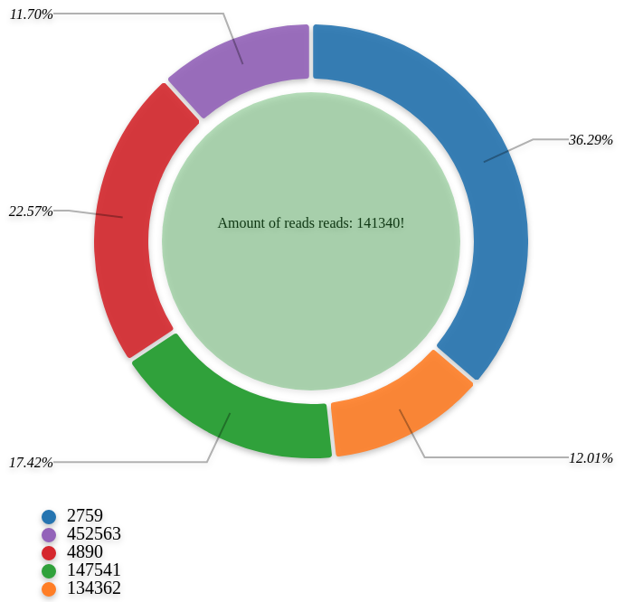

# D3 Donut Chart Directive for JavaScript

### A JavaScript library that provide easy way to create donut chart simply setting atributes in a div.

## How to use:
- Import **d3-donut-chart-directive** in the html that you want to use.

```html
<htnl>
    <head>
      <meta charset="utf-8">
      <link rel="stylesheet" type="text/css" href="../style/d3-donut-chart.min.css">
    </head>

    <body>
        ...
    </body>

    <script src="https://d3js.org/d3.v4.min.js"></script>
    <script src="https://d3js.org/d3-scale-chromatic.v0.3.min.js"></script>

    <script src="../script/d3-donut-chart.min.js"></script>

</htnl>
```

- Create divs with custom atributes and add donut-chart as style class.
```html
...
<body>
    ...
    <div 
        class="donut-chart" 
        label="taxonomy"
        slice="reads"
        size="600"
        tooltip="circle"
        tooltip-msg="Amount of reads </br>reads: {{reads}}!"
        url="http://www.mocky.io/v2/5a985ae62e000001075532fb" 
    ></div>
    ...
</body>
...
```

> JSON requested in this example have this content:

```json
[
        {
        "taxonomy": 2759,
		"reads": 294481
	},
	{
		"taxonomy": 134362,
		"reads": 97446
	},

	{
		"taxonomy": 147541,
		"reads": 141340
	},
	{
		"taxonomy": 4890,
		"reads": 183141
	},
	{
		"taxonomy": 452563,
		"reads": 94952
	}
]
```

- Done, now can see your chart in the browser:



## Atributes details

#### **CLASS DONUT-CHART** 
- Is the key attr to indicate that the div render a donut chart.
```html
class="donut-chart"
```

#### **LABEL** 
- Specify the field that the donut directive use to print the label of the chart's slices.
```html
label="taxonomy"
```

#### **SLICE** 
- Specify the field that the donut directive use to render the chart's slices.
```html
slice="reads"
```

#### **SIZE** 
- Specify the size (height/width) of the donut chart.
```html
size="300"
```

#### **TOOLTIP** 
- Specify the style of tooltip that is rendered when mouse is hover the one slice. Have two styles "circle" that is a circle inside the donut and "popover" that is a popover over the mouse pointer.
```html
tooltip="circle"
```
```html
tooltip="popover"
```

#### **TOOLTIP** 
- Specify the message to render inside tooltip. It can be a html string if tooltip is setted as "popover". The directive support write one attribute inside double braces {{}}.
```html
tooltip-msg="Amount of reads </br>reads: {{reads}}!"
```

#### **URL** 
- Specify the endpoint or file path to get json data to render the chart.
```html
url="http://www.mocky.io/v2/5a94693f3500003c009b0e95"
```
```html
url="./mock/mock.json"
```

## Attributes Table
| Attr | Function |
| ------ | ------ |
| class | -|
| label | -|
| slice | -|
| size | -|
| tooltip | -|
| tooltip-msg | -|
| url | -|

## License

MIT LICENSE


